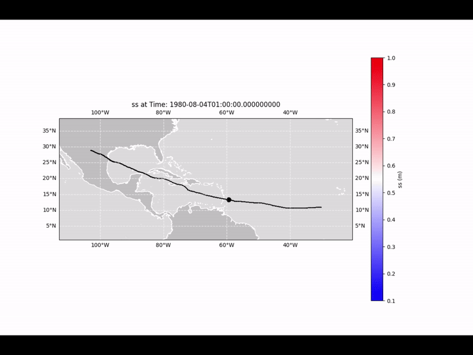

# Hazard tracker

   <!-- Path to your logo -->

This repository provides a configurable pipeline for detecting,
clustering, and analyzing storm surge events using numerical model
outputs and observational datasets.

The workflow identifies storm surge peaks, tracks spatio-temporal
clusters using DBSCAN, and extracts surge hydrographs for further
validation and feature analysis.

funded by the European Union through the project Detection and Global Risk Assessment of Coastal Transitional Climate and Neo-Climate Regions in a Warming World
01111262 — TransClima — HORIZON-MSCA-2022-PF-01 

------------------------------------------------------------------------

## Repository Structure


    .
    ├── hazar_tracker.py
    ├── feature_importance.py
    ├── tracker_utils.py
    ├── feneral_utils.py
    ├── config*.json
    ├── environment.yml
    └── README.md


------------------------------------------------------------------------

## Requirements

``` bash
conda env create -f environment.yml
conda activate transcatalog
```

------------------------------------------------------------------------

## How to Run

``` bash
python main.py config3.json
```

Optional overrides:

``` bash
python main.py config3.json --basin=NA --storm_index=0
```

------------------------------------------------------------------------

## Configuration File

Example:

``` json
{
  "basin": "NA",
  "storm_index": 0,
  "threshold_peak": 0.5,
  "threshold_min": 0.1,
  "DBSCAN_eps": 1.5,
  "DBSCAN_min_samples": 5,
  "delta": 6,
  "variable_name": "ss",
  "case_id": "config3",
  "KM_ncentroids": 5
}
```

------------------------------------------------------------------------

## Outputs

Results are stored in:

storm_catalogue_ss\_`<case_id>`{=html}/`<basin>`{=html}/

Including tracked clusters and surge hydrographs.

------------------------------------------------------------------------

## Demo


------------------------------------------------------------------------

## Post-processing

Run:

``` bash
python main_feature_importance.py
python validation.py

```

------------------------------------------------------------------------


## Author and Contact
@itxasoOderiz
itxaso.oderiz@unican.es
